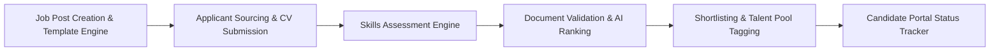
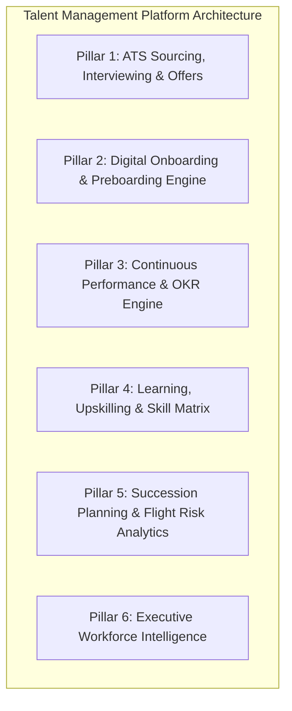
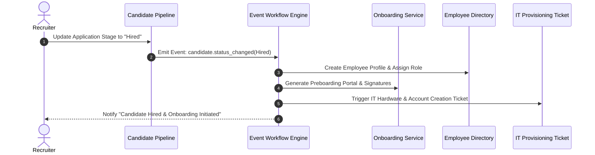
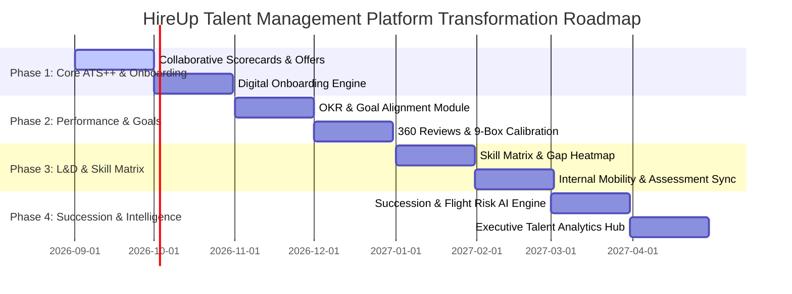

# Strategic Master Plan: Transforming HireUp into a True Enterprise Talent Management Platform (TMP)

## Executive Summary & Vision
**HireUp** is currently a high-performing **Applicant Tracking System (ATS) and Candidate Assessment Engine**, featuring job post customization, skills testing, candidate pipeline ranking, document parsing, reference endorsements, and candidate portal status tracking.

To evolve HireUp into a **True Talent Management Platform (TMP)**, the platform must expand beyond candidate acquisition to cover the **entire employee lifecycle**: **Attract $\rightarrow$ Hire $\rightarrow$ Onboard $\rightarrow$ Develop $\rightarrow$ Perform $\rightarrow$ Retain/Promote**.

This document presents a comprehensive review of the current system, gap analysis, 6 core strategic functional pillars, architectural transformations, and a 4-phase execution plan.

---

## 1. Current App State & Workflow Audit



### Current Strengths
- **Customizable Job Application Builder**: Template-driven form editor (`ManagerComponent`, `ApplicationViewComponent`).
- **Integrated Pre-Employment Testing**: Interactive test generator (`CreateTestComponent`), timed taking (`TakeTestComponent`), and automated grading (`SubmissionsComponent`).
- **AI-Powered Screening**: Document parsing, PII validation, candidate ranking algorithms (`ranking.py`, `document_validation.py`).
- **Reference & Endorsement Engine**: Solicit and aggregate candidate references (`JobReferencesComponent`, `SubmitEndorsementComponent`).
- **Modern Tech Stack**: Angular 19 (Signals, Standalone Components) frontend + FastAPI Python backend.

### Critical Gaps for Talent Management
1. **Post-Offer Drop-off**: Workflow terminates once a candidate is marked "Hired". No digital onboarding, document e-signing, or preboarding transition.
2. **No Performance & Goal Tracking**: Lacks 360-degree performance reviews, OKRs/KPIs, 1-on-1 check-ins, or 9-box potential calibration grids.
3. **No Skill Matrix or Internal Mobility**: Pre-employment tests are isolated from employee upskilling, internal career pathways, and skill gap identification.
4. **No Succession Planning or Flight Risk Analytics**: Absence of critical role succession pipelines, talent bench strength evaluation, or retention risk indicators.
5. **Role Restrictions**: User roles are primarily split between Recruiter/Admin and Candidate; lacks Manager, Peer Evaluator, Employee, and HR Business Partner (HRBP) persona workflows.

---

## 2. Six Core Pillars of the Talent Management Platform



---

### Pillar 1: Full-Lifecycle Acquisition, Interviewing & Offer Management
*Enhancing existing recruiting capabilities into an enterprise hiring workflow.*

- **Collaborative Interview Scorecards & Rubrics**:
  - Structured interview guides tied to specific competencies.
  - Multi-interviewer rating matrix with bias-mitigation score hiding until all reviews are submitted.
  - Panel consensus notes & automated interviewer feedback summaries.
- **Smart Interview Scheduler**:
  - Google Workspace & Microsoft 360 Calendar integration (`outlook_connector.py` extension).
  - Candidate self-scheduling links with auto-generated video room links (Google Meet / Zoom / MS Teams).
- **Offer Management & E-Signature Studio**:
  - Dynamic offer letter generator with salary, equity, benefits, and start-date tokens.
  - Integrated digital signature workflow for offer acceptance.

---

### Pillar 2: Digital Onboarding & Preboarding Engine
*Bridging candidate hiring to employee enablement.*

- **Automated Lifecycle Transition Trigger**:
  - When candidate status moves to `Hired`, automatically provision an **Employee Workspace** and trigger the **Preboarding Portal**.
- **Interactive Preboarding Hub**:
  - Welcome video, company culture deck, team introductions, and buddy/mentor assignment.
- **Document & Asset Compliance Workflow**:
  - Digital signing of NDAs, tax forms (W-4 / I-9 / local equivalents), and direct deposit details.
  - IT & Asset provisioning checklist (laptop, email creation, software licenses) with automated IT desk tickets.
- **30-60-90 Day Orientation Plans**:
  - Structured milestones, mandatory training assignments, and automated manager 30-day check-in reminders.

---

### Pillar 3: Continuous Performance & OKR Management
*Drive employee alignment, growth, and accountability.*

- **Goal & OKR Alignment Engine**:
  - Cascade company strategic objectives down to department goals and individual OKRs.
  - Progress tracking with real-time target status indicators and key result updates.
- **360-Degree & Quarterly Review Cycles**:
  - Flexible review templates (Self-Assessment, Peer Reviews, Manager Evaluation, Direct Report Feedback).
  - Competency rating scales with qualitative feedback prompts.
- **9-Box Talent Calibration Matrix**:
  - Interactive grid plotting **Performance vs. Potential** for leadership calibration meetings.
  - Drag-and-drop calibration adjustments with audit trail for succession planning.
- **Continuous 1-on-1 & Check-in Hub**:
  - Weekly/Monthly 1-on-1 meeting agendas, action items tracking, and private manager notes.

---

### Pillar 4: Learning & Development (L&D) and Skill Matrix Architecture
*Transform static testing into continuous employee growth.*

- **Enterprise Skill Matrix & Inventory**:
  - Centralized taxonomy of organizational skills and competency proficiency levels (1-5).
  - Heatmap visualizing skill coverage vs. skill gaps across departments and teams.
- **Repurposing the Assessment Engine for Internal Learning**:
  - Evolve `jobtest-api` into an **Internal Knowledge & Certification Center**.
  - Assign skill evaluations, compliance modules, and professional development quizzes to existing employees.
- **Internal Career Pathways & Mobility Marketplace**:
  - AI recommendations for internal job opportunities based on employee skill match.
  - Career progression visualizer showing required skills and training to reach target roles.

---

### Pillar 5: Succession Planning, Flight Risk & Retention
*Protect organizational continuity and retain top talent.*

- **Succession Pipeline Builder**:
  - Map critical leadership and specialized roles to primary, secondary, and emergency successors.
  - Readiness indicators (*Ready Now*, *Ready in 1 Year*, *Ready in 2+ Years*).
- **AI Flight Risk & Retention Predictor**:
  - Early-warning indicators analyzing tenure, review sentiment, time since last promotion/raise, and 1-on-1 engagement frequency.
  - Recommended manager retention intervention actions.
- **Employee Engagement & Sentiment Pulse Engine**:
  - Automated micro-pulse surveys (e.g., eNPS, team morale, workload stress).
  - Anonymous feedback channels with NLP sentiment analysis.

---

### Pillar 6: Unified Strategic Workforce Intelligence
*Executive-level analytics across the full talent lifecycle.*

- **Unified Talent Analytics Dashboard**:
  - Single glass pane combining Acquisition, Performance, Mobility, and Retention.
- **Key Metrics Tracked**:
  - *Quality of Hire*: Performance ratings of hires at 6 & 12 months vs. initial candidate score.
  - *Time-to-Productivity*: Days taken for new hires to achieve full OKR throughput.
  - *Turnover & Retention Analysis*: Voluntary vs. involuntary churn by department, manager, and tenure.
  - *Pay Equity & Diversity Analytics*: Gender/diversity representation across leadership tiers and pay bands.

---

## 4. Architecture & Technical Transformation Plan

### 4.1 Role-Based Access Control (RBAC) Matrix
The platform will expand from 2 roles (Recruiter, Candidate) to 6 granular roles:

| Feature / Workspace | Candidate | Employee | Hiring Manager | Recruiter | HR Business Partner | System Admin |
| :--- | :---: | :---: | :---: | :---: | :---: | :---: |
| Apply & Track Status | $\checkmark$ | | | | | |
| Onboarding & 30-60-90 | | $\checkmark$ | Direct Reports | | $\checkmark$ | $\checkmark$ |
| OKRs & 1-on-1s | | $\checkmark$ | Direct Reports | | $\checkmark$ | $\checkmark$ |
| Perform 360 Reviews | | Peer/Self | Direct Reports | | Full Org | $\checkmark$ |
| Candidate Pipeline & Tests | | | Job Specific | Full Access | Full Access | $\checkmark$ |
| 9-Box & Succession | | | Department | | Full Access | $\checkmark$ |
| System Config & Audit | | | | | | $\checkmark$ |

---

### 4.2 Event-Driven Workflow Automation Engine
To connect all components seamlessly, an event broker architecture will execute triggers:



---

### 4.3 Backend API Architecture Expansion (FastAPI)

#### New Database Schemas & Models:
- `employees`: Extends candidate profile with employee ID, department, manager ID, job title, hire date, salary tier.
- `onboarding_tasks`: Task ID, employee ID, title, document link, required sign-off, due date, status.
- `performance_cycles`: Cycle ID, name, start/end dates, state (Draft, Active, Calibration, Closed).
- `performance_reviews`: Review ID, cycle ID, subject ID, reviewer ID, relationship (Self, Peer, Manager), status, ratings JSON.
- `okrs`: Goal ID, owner ID (user/dept/company), parent goal ID, title, target value, current value, status.
- `skills_inventory`: Skill ID, user ID, proficiency level (1-5), verified status, last evaluated date.
- `succession_plans`: Role ID, incumbent ID, candidate employee ID, readiness tier, development plan.

#### New FastAPI Routers:
- `/api/v1/onboarding`: Manage preboarding workflows and document execution.
- `/api/v1/performance`: Reviews, 360 feedback, 9-box calibration data.
- `/api/v1/goals`: OKRs creation, tracking, and alignment graph.
- `/api/v1/skills`: Skill matrix, gap analysis, employee competency profiles.
- `/api/v1/succession`: Succession planning & flight risk metrics.
- `/api/v1/workforce-analytics`: Executive aggregated talent metrics.

---

### 4.4 Frontend Architecture Expansion (Angular 19)

#### Refactored Application Navigation:
```text
/src/app/pages/
├── auth/                       # Authentication & RBAC Login
├── candidate-portal/           # External Candidate Portal
├── recruiter/                  # Sourcing, ATS, Application Manager
├── onboarding/                 # Digital Onboarding & Preboarding Hub
│   ├── employee-welcome/
│   ├── document-signing/
│   └── setup-checklist/
├── performance/                # Continuous Performance Management
│   ├── okr-dashboard/
│   ├── reviews-360/
│   ├── calibration-9box/
│   └── continuous-checkins/
├── learning-skills/            # L&D and Skill Matrix
│   ├── skill-matrix/
│   ├── assessment-center/      # Reused & extended test component
│   └── career-paths/
├── succession/                 # Succession Planning & Flight Risk
└── executive-analytics/        # Unified Workforce Intelligence Dashboard
```

---

## 5. Phased Implementation Roadmap



### Phase 1: ATS Enhancements & Digital Onboarding (Months 1–2)
- [ ] Implement Interview Scorecard Rubrics and Interview Scheduler.
- [ ] Build Digital Offer Letter Generator & E-Signature flow.
- [ ] Create `onboarding` page & services for newly hired candidates.
- [ ] Build Event Trigger: Candidate status `Hired` $\rightarrow$ Employee creation.

### Phase 2: Continuous Performance & OKR Engine (Months 3–4)
- [ ] Develop OKR & Goal alignment tracking component.
- [ ] Build 360-degree Review Cycle builder and reviewer interface.
- [ ] Implement interactive 9-Box Talent Calibration Matrix.
- [ ] Add 1-on-1 check-in meeting logs & action items tracker.

### Phase 3: L&D, Skill Matrix & Internal Mobility (Months 5–6)
- [ ] Construct Organizational Skill Taxonomy and Skill Matrix Heatmap.
- [ ] Bridge existing `jobtest-api` assessment engine to internal employee skill evaluations.
- [ ] Launch Internal Mobility Marketplace & Career Progression visualizer.

### Phase 4: Succession Planning & Executive Workforce Intelligence (Months 7–8)
- [ ] Build Succession Pipeline builder for key roles.
- [ ] Train/integrate Flight Risk Prediction model based on engagement & review data.
- [ ] Launch Employee Pulse & Sentiment Survey engine.
- [ ] Assemble Executive Unified Workforce Analytics Dashboard.

---

## 6. Strategic ROI & Business Impact

1. **Reduced Time-to-Productivity**: Preboarding and 30-60-90 day orientation accelerate new hire ramp-up by **35%**.
2. **Higher Retention & Lower Turnover**: Continuous 1-on-1 check-ins and flight risk alerts help reduce voluntary turnover by **25%**.
3. **Internal Sourcing Savings**: Filling roles via internal mobility & skill matrix matching reduces agency sourcing spend by **40%**.
4. **Unified Single-Source-of-Truth**: Replaces 4-5 disconnected tools (ATS, Performance software, LMS, Onboarding forms) with one unified HireUp platform.
